# Práctica Formativa Obligatoria 2 - Prompt Engineering en Agentes de IA

### Datos del Estudiante
- **Nombre y Apellido:** Alejandra Vazquez
- **Institución:** IFTS N.°29
- **Materia:** Desarrollo de Sistemas Web (Front End)-2° D

---

### Link al Deploy Unificado
- **URL del Proyecto:** [pfo-2-front-alejandra-vazquez.vercel.app](https://vercel.com/alevaz70s-projects/pfo-2-front-alejandra-vazquez)

---

### Prompt Inicial de Alta Precisión Utilizado
```text
Rol: Rol: Eres un Ingeniero de Software Frontend Senior experto en UX/UI y maquetación web limpia, moderna y responsiva.

Contexto: Necesito crear de forma completamente autónoma una Landing Page para una agencia de servicios digitales llamada "Nexus Digital". El diseño debe ser moderno, con una paleta de colores profesional (sugerencia: azul oscuro/negro de fondo, detalles en cian o violeta neón, y texto blanco/gris claro), tipografía limpia (como Inter o Roboto) y espaciados amplios (componentes que respiren).

Requisitos Técnicos:
- Usa HTML5 semántico, CSS3 moderno (puedes usar Flexbox/Grid o frameworks CSS como Tailwind si está disponible en tu entorno) y JavaScript vanilla si es necesario para interactuar.
- No uses librerías externas que requieran configuraciones complejas de backend. Todo debe funcionar del lado del cliente.
- El diseño debe ser 100% responsivo (mobile-first), viéndose perfecto tanto en celulares como en computadoras de escritorio.

Estructura Obligatoria de la Landing Page (Crear todas las secciones en el mismo archivo o estructura indexada):

1. Cabecera (Header):
   - Logo ficticio de "Nexus Digital" a la izquierda.
   - Menú de navegación a la derecha con enlaces suaves (smooth scroll) a las secciones: Inicio, Sobre Nosotros, Servicios, Testimonios, Contacto.

2. Hero Section (Sección Principal):
   - Un título principal (H1) impactante y disruptivo sobre transformación digital.
   - Un subtítulo breve que explique el valor de la agencia.
   - Un botón de Llamada a la Acción (CTA) llamativo que diga "Impulsar mi negocio".

3. Sobre Nosotros (Descripción):
   - Una sección limpia que explique la misión de la agencia de forma profesional, acompañada de una disposición gráfica atractiva (puede ser un layout de dos columnas, texto e imagen/vector ilustrativo).

4. Servicios:
   - Una cuadrícula (Grid/Cards) con las 3 características o servicios principales: 
     a) Desarrollo Web & Apps.
     b) Estrategia de Marketing Digital.
     c) Optimización SEO y Analítica.
   - Cada servicio debe tener un icono representativo, un título y una descripción corta.

5. Testimonios:
   - Una sección que muestre al menos 2 o 3 reseñas/testimonios de clientes ficticios satisfechos, incluyendo nombre, puesto, empresa y una foto de perfil simulada (puedes usar avatares de placeholder).

6. Formulario de Contacto:
   - Maquetado visual completo de un formulario profesional.
   - Campos requeridos: Nombre completo, Correo electrónico, Asunto y Mensaje.
   - Botón de envío estilizado. No requiere funcionalidad backend, solo el diseño visual limpio.

7. Pie de Página (Footer):
   - Enlaces de navegación secundarios.
   - Iconos o enlaces de texto a redes sociales ficticias (LinkedIn, Twitter, Instagram).
   - Derechos de autor: "© 2026 Nexus Digital. Todos los derechos reservados."

```
### Comparativa de Agentes y Capturas de Pantalla

#### Captura de pantalla incio:
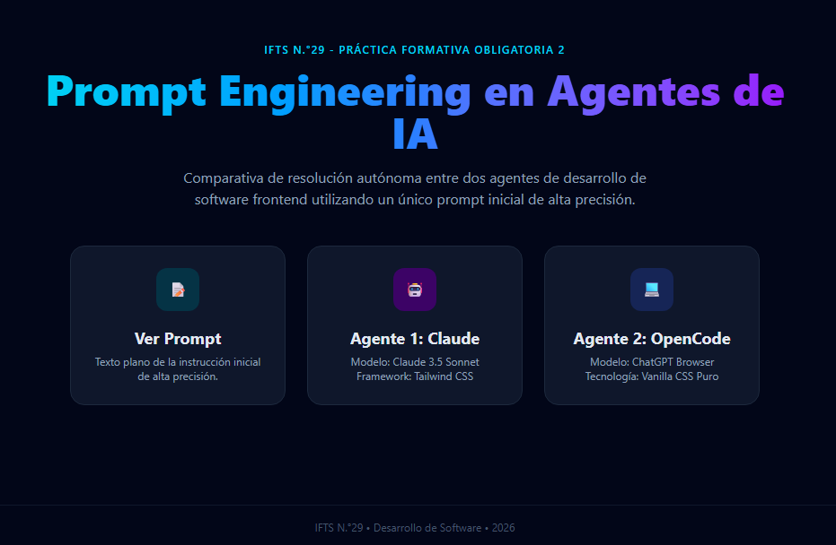


🤖 Agente 1: Claude
Modelo: Claude 3.5 Sonnet

Tecnologías: Tailwind CSS via CDN, Lucide Icons, Vanilla JavaScript.

Análisis: Resolvió la interfaz con una estética moderna y neón, utilizando componentes responsivos fluidos y librerías de iconos externos.

#### Captura de pantalla (Claude):
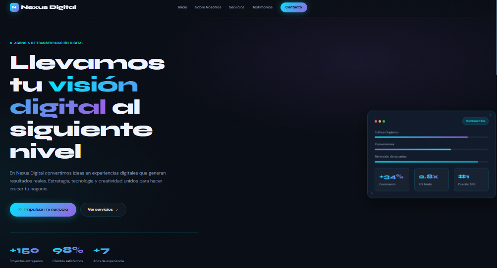
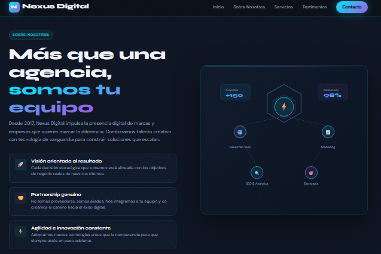
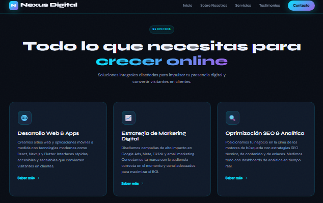
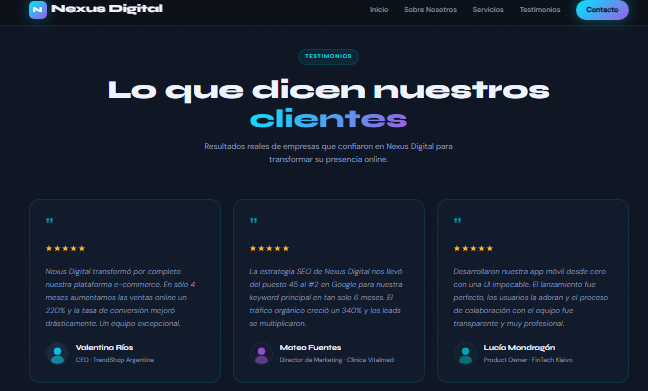
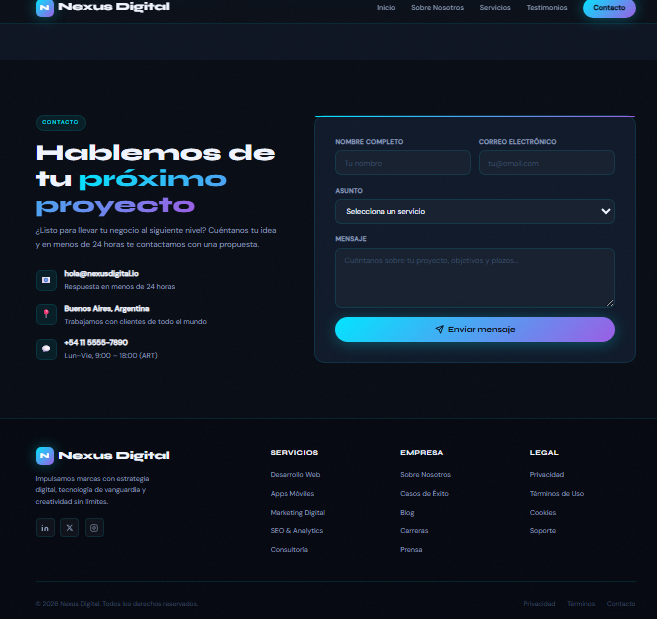

💻 Agente 2: OpenCode
Modelo: ChatGPT Browser

Tecnologías: Vanilla CSS (Flexbox y Grid nativo), Unicode/Emojis para iconos.

Análisis: Optó por un enfoque corporativo clásico y minimalista, estructurando todo el diseño con estilos puros escritos desde cero dentro del documento, sin dependencias externas.

#### Capturas de pantalla (OpenCode):
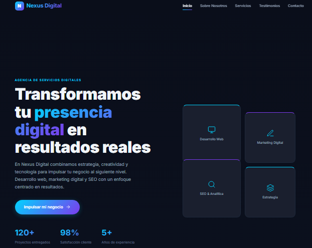
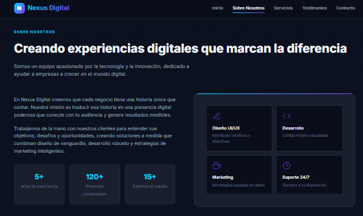
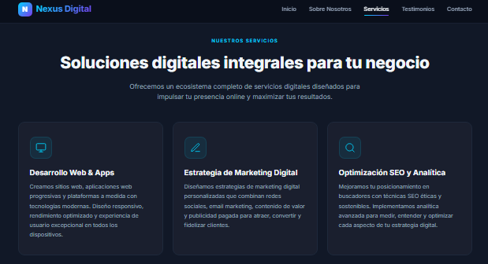
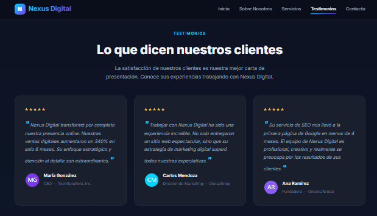
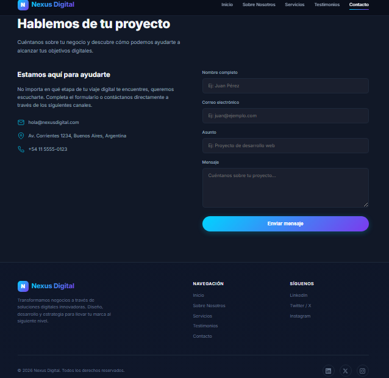


